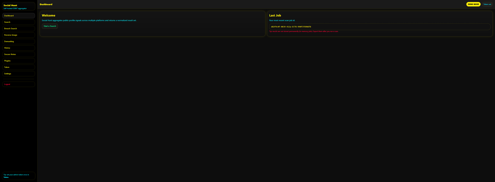
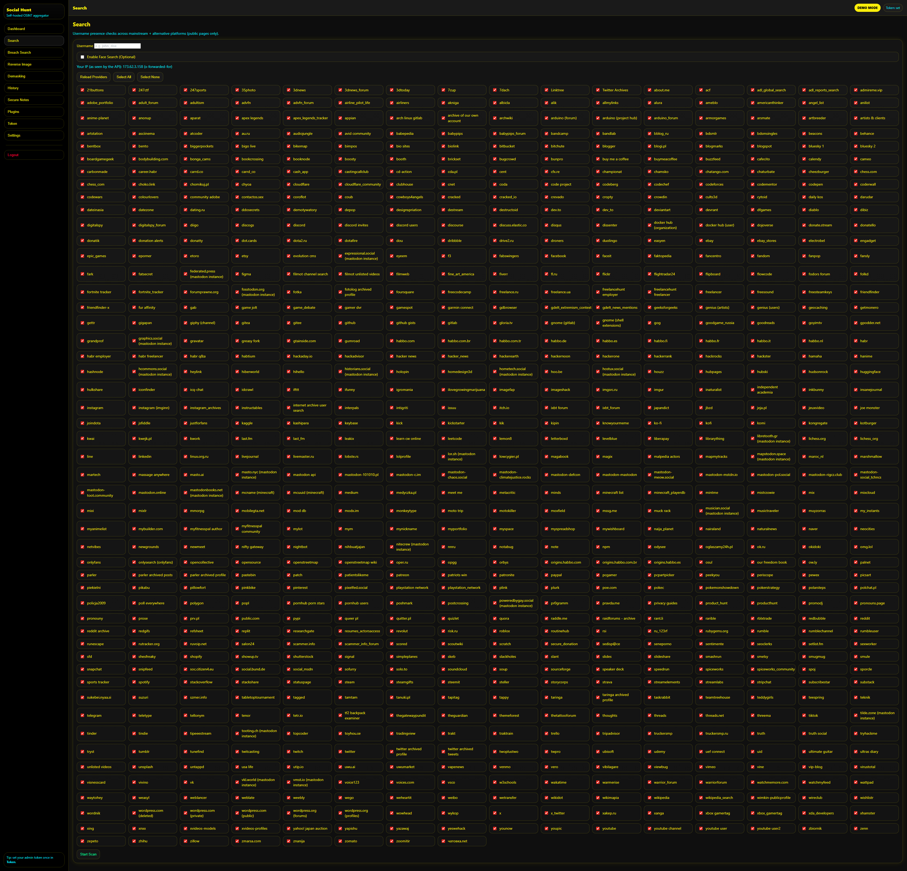
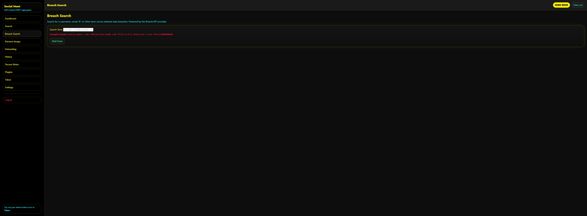
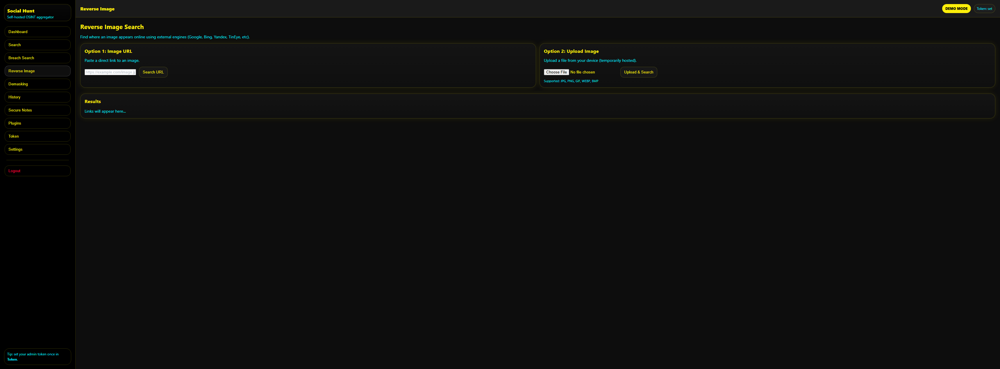
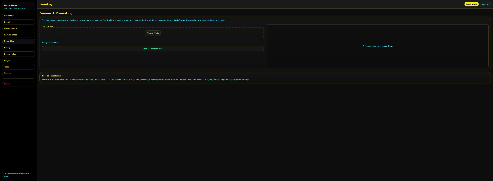
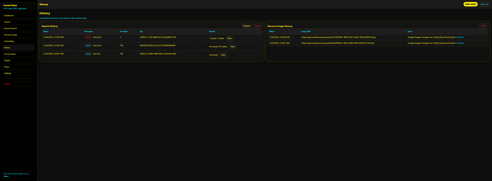
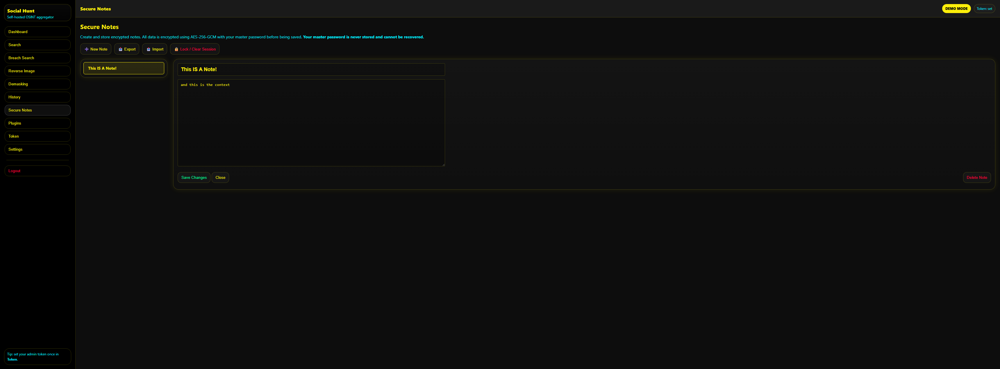
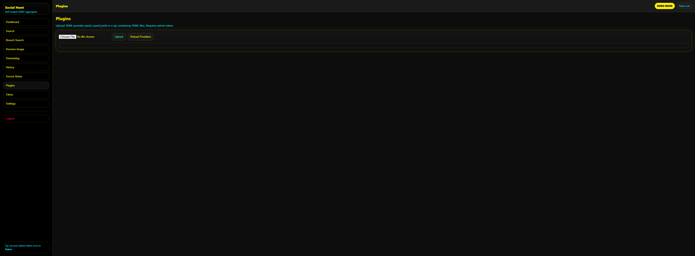
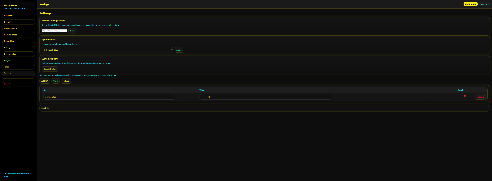

# Social-Hunt

> Self-hosted OSINT aggregator — username discovery, breach intelligence, reverse image search, AI face restoration, voter records, Google dorks, secure notes, and more. Ships with a polished web dashboard and a CLI.



---

## Table of Contents

- [Features](#features)
- [Screenshots](#screenshots)
- [Architecture](#architecture)
- [Quick Start](#quick-start)
  - [Docker (recommended)](#docker-recommended)
  - [Docker + Reverse Proxy](#docker--bundled-reverse-proxy-nginx-or-apache)
  - [Docker + SSL](#docker--ssl-nginx--iopaint)
  - [Non-Docker (Windows)](#non-docker-windows)
  - [Manual Install](#manual-install)
  - [Raspberry Pi 5 Setup](#raspberry-pi-5-setup)
- [CLI Usage](#cli-usage)
- [Configuration](#configuration)
- [Login Security](#login-security)
- [Feature Guides](#feature-guides)
  - [Username Search](#username-search)
  - [Breach Search](#breach-search)
  - [Reverse Image OSINT](#reverse-image-osint)
  - [Google Dorks](#google-dorks)
  - [Voter Records](#voter-records)
  - [AI Demasking](#ai-demasking)
  - [Secure Notes](#secure-notes)
  - [History](#history)
  - [Plugin System](#plugin-system)
  - [Demo Mode](#demo-mode)
  - [Tor / Darkweb Support](#tor--darkweb-support)
- [Project Structure](#project-structure)
- [Documentation](#documentation)
- [Contributors](#contributors)
- [Legal and Ethics](#legal-and-ethics)

---

## Features

| Feature | Description |
|---|---|
| **Username Search** | Cross-platform presence scanning across hundreds of sites using YAML + Python provider packs. Optional enhanced face search via uploaded reference images. |
| **Breach Search** | Email, username, IP, and phone lookups across indexed breach databases — HIBP, BreachVIP, Snusbase, LeakCheck. Auto-detects input type. |
| **Reverse Image OSINT** | Generates ready-to-use search links for Google Lens, Bing Visual Search, Yandex Images, TinEye, and more. Supports URL input and file upload. |
| **Google Dorks** | Built-in library of 100 + categorised Google search operator templates for domains, names, usernames, emails, and companies. One-click search and bulk export. |
| **Voter Records** | Direct links to 20 + official US state voter registration portals (AZ, CO, FL, GA, IL, KS, KY, MD, MI, MN, NJ, NY, NC, OH, OK, OR, PA, SC, TX, UT, VA, WA, WI). |
| **AI Demasking** | Face restoration and mosaic removal via Replicate cloud API, interactive IOPaint server, or automated DeepMosaic — all from the dashboard. |
| **Secure Notes** | AES-GCM encrypted note vault locked by a master password. Notes never leave your browser unencrypted. Export / import as encrypted JSON. |
| **History** | Persistent log of all searches, reverse image lookups, and demasking jobs with quick re-open and re-run. |
| **Plugin System** | Hot-reload YAML and Python provider packs. Optional web-based uploader. Install community packs from the plugins directory in-app. |
| **Dashboard** | Live system status, search stats, rotating OSINT tips, and quick-access links to recent searches. |
| **Themes** | Multiple built-in colour themes (default dark, Tokyo Night, Cobalt) — applies instantly without page reload. |
| **Demo Mode** | Censors sensitive output for safe screen shares and demonstrations. Toggle in Settings. |
| **Tor / Onion Support** | Route requests through a SOCKS proxy for `.onion` provider packs with optional split-tunnelling. |
| **Token Auth** | Single admin token protects the entire dashboard. Bootstrap mode for first-run setup. Optional hCaptcha. |

---

## Screenshots

| | |
|---|---|
|  **Login** |  **Dashboard** |
|  **Username Search** |  **Breach Search** |
|  **Reverse Image** |  **AI Demasking** |
|  **History** |  **Secure Notes** |
|  **Plugins** |  **Settings** |

---

## Architecture

- **Backend:** FastAPI + httpx async scanning engine (Python 3.11+)
- **Frontend:** Vanilla HTML / CSS / JS — no heavy framework, fast loads
- **Core engine:** Async concurrency with per-provider heuristics and status detection
- **Storage:** JSON flat-files for settings and job results; notes encrypted in browser localStorage
- **Optional services:** Replicate (cloud AI), IOPaint (interactive inpainting), DeepMosaic (automated mosaic removal)

---

## Quick Start

### Docker (recommended)

```bash
git clone https://github.com/AfterPacket/Social-Hunt.git
cd Social-Hunt/docker
docker compose up -d --build
```

Open `http://localhost:8000`. Set your admin token on the **Token** page.

---

### Docker + bundled reverse proxy (nginx or apache)

Exposes the app on port 80:

```bash
cd Social-Hunt/docker

# Nginx
docker compose --profile nginx up -d --build

# Apache
docker compose --profile apache up -d --build
```

Open `http://localhost/`.

To include the AI workers (IOPaint + DeepMosaic) alongside the proxy:

```bash
docker compose --profile nginx --profile ai up -d --build
```

---

### Docker + SSL (nginx + AI workers)

HTTPS termination. Social-Hunt serves `/`; the AI workers run in sibling
containers and are reached over the internal network (`IOPAINT_URL`,
`DEEPMOSAIC_URL`). IOPaint's web UI is opened directly on port `8080` from the
dashboard (separate origin) — it is not proxied under a subpath.

```bash
cd Social-Hunt/docker
python setup_ssl.py
docker compose --profile certbot run --rm --service-ports certbot
docker compose --profile ssl up -d
```

Open `https://your-domain`.

---

### Non-Docker (Windows)

For Windows machines without Docker, two PowerShell scripts in `scripts/` create
isolated Python environments for the AI workers (IOPaint, DeepMosaic) and launch
all three services as background processes. The main app stays on secure
Pillow 12 with no torch; the workers keep their own (legacy) torch + Pillow in
separate venvs. The app reaches them over loopback HTTP.

One-time setup (creates `.venv-iopaint` and `.venv-deepmosaic`, clones
DeepMosaics, downloads models):

```powershell
powershell -ExecutionPolicy Bypass -File scripts\setup-ai.ps1
```

Start everything (Social-Hunt :8000, IOPaint :8080, DeepMosaic :8081):

```powershell
powershell -ExecutionPolicy Bypass -File scripts\start-social-hunt.ps1
```

Stop everything:

```powershell
powershell -ExecutionPolicy Bypass -File scripts\start-social-hunt.ps1 -Stop
```

Use `127.0.0.1` (not `localhost`) — uvicorn binds IPv4 and Windows often
resolves `localhost` to IPv6 `::1`, which is not served. See
[`docker/docs/IOPAINT_GUIDE.md`](docker/docs/IOPAINT_GUIDE.md) for details and
`FIXES.md` for why the workers are isolated.

---

### Manual install

```bash
git clone https://github.com/AfterPacket/Social-Hunt.git
cd Social-Hunt
python -m pip install -r requirements.txt
# Optional — Tor/SOCKS support:
python -m pip install httpx[socks]
python run.py
```

Open `http://localhost:8000`.

For a detailed walkthrough (virtualenv, tokens, reverse proxy), see [`README_RUN.md`](README_RUN.md).

---

### Raspberry Pi 5 Setup

Social-Hunt runs on Raspberry Pi 5 (Raspberry Pi OS Bookworm, 64-bit). DeepMosaic is not recommended on Pi due to storage and compute constraints — all other features work.

The default system Python on Bookworm is 3.11+ which is fine, but `pip install -r requirements.txt` will fail due to Pillow / dlib compatibility issues with newer setuptools. The fix is to use **pyenv** to pin Python 3.11.9.

#### 1. Install build dependencies

```bash
sudo apt update
sudo apt install -y build-essential curl git \
  libssl-dev zlib1g-dev libbz2-dev libreadline-dev \
  libsqlite3-dev libffi-dev libncursesw5-dev xz-utils \
  tk-dev libxml2-dev libxmlsec1-dev liblzma-dev
```

#### 2. Install pyenv

```bash
curl https://pyenv.run | bash
```

Add to `~/.bashrc`:

```bash
export PYENV_ROOT="$HOME/.pyenv"
export PATH="$PYENV_ROOT/bin:$PATH"
eval "$(pyenv init -)"
```

Then:

```bash
source ~/.bashrc
```

#### 3. Install Python 3.11.9

```bash
pyenv install 3.11.9
pyenv global 3.11.9
python --version  # should print Python 3.11.9
```

#### 4. Create venv and install dependencies

```bash
cd Social-Hunt
python -m venv venv
source venv/bin/activate
pip install --upgrade pip setuptools wheel
pip install -r requirements.txt
```

#### 5. Run

```bash
python run.py
```

Open `http://<pi-ip>:8000`.

#### 6. Run as a systemd service (optional)

```bash
sudo cp systemd/social-hunt.service.example /etc/systemd/system/social-hunt.service
# Edit the file and set WorkingDirectory and ExecStart paths
sudo systemctl daemon-reload
sudo systemctl enable --now social-hunt
```

#### Known Pi limitations

- DeepMosaic requires large model downloads and significant compute — skip on Pi.
- IOPaint can run on CPU but is slow; use the Replicate API instead.
- Face matching (`dlib`) compiles from source on first install — this takes a few minutes on Pi.

---

## CLI Usage

```bash
python -m social_hunt.cli --help

# Username search
python -m social_hunt.cli search <username>

# Search with specific providers
python -m social_hunt.cli search <username> --providers github_api,reddit_json

# Export results to JSON
python -m social_hunt.cli search <username> --output results.json
```

---

## Configuration

### Settings file

Settings are stored in `data/settings.json` and managed from the dashboard **Settings** page. They can also be set via environment variables (which take precedence).

| Key | Description |
|---|---|
| `admin_token` | Dashboard access token (min 20 chars) |
| `hibp_key` | Have I Been Pwned API key |
| `snusbase_key` | Snusbase API key |
| `leakcheck_key` | LeakCheck API key |
| `breachvip_key` | BreachVIP API key |
| `replicate_key` | Replicate API key (AI demasking) |
| `public_url` | Base URL for the instance (used in exports) |
| `theme` | UI colour theme (`default`, `tokyo`, `cobalt`) |
| `demo_mode` | Censor sensitive output (`true` / `false`) |

### Environment variables

All settings can be set as environment variables (useful for Docker / CI):

| Variable | Description |
|---|---|
| `SOCIAL_HUNT_PLUGIN_TOKEN` | Overrides `admin_token` from settings |
| `SOCIAL_HUNT_HOST` | Bind address (default `0.0.0.0`) |
| `SOCIAL_HUNT_PORT` | Port (default `8000`) |
| `SOCIAL_HUNT_RELOAD` | Hot-reload for development (`1` / `0`) |
| `SOCIAL_HUNT_SETTINGS_PATH` | Custom path for `settings.json` |
| `SOCIAL_HUNT_JOBS_DIR` | Custom path for job result storage |
| `SOCIAL_HUNT_ENABLE_TOKEN_BOOTSTRAP` | Allow first-run token set via UI (`1`) |
| `SOCIAL_HUNT_BOOTSTRAP_SECRET` | Secure secret for bootstrap endpoint |
| `SOCIAL_HUNT_ENABLE_WEB_PLUGIN_UPLOAD` | Enable plugin upload via dashboard (`1`) |
| `SOCIAL_HUNT_FACE_AI_URL` | Self-hosted face AI endpoint URL |
| `HCAPTCHA_SECRET` | hCaptcha server secret (enables captcha on login) |
| `HCAPTCHA_SITEKEY` | hCaptcha site key (sent to frontend) |

---

## Login Security

### Rate limiting

The login endpoint has built-in progressive rate limiting:

- **5 failed attempts** → 1-minute lockout
- **10 failed attempts** → 5-minute lockout
- **20+ failed attempts** → 15-minute lockout

Lockout state resets on successful login. All failed attempts are logged to the server console.

### hCaptcha (optional)

Add bot protection to the login form:

1. Sign up at [hcaptcha.com](https://hcaptcha.com) and create a site.
2. Set `HCAPTCHA_SECRET` and `HCAPTCHA_SITEKEY` in your environment or `settings.json`.
3. Restart — the login page will automatically show the hCaptcha widget.

---

## Feature Guides

### Username Search

Scans hundreds of social platforms and services for a username using YAML-defined providers.

**How to use:**
1. Enter the target username (no `@` prefix needed).
2. Select providers — use **All** / **None** toggles or pick individually.
3. Optionally enable **Enhanced Face Search** and upload reference photos.
4. Click **Start Investigation**.

Results show profile URL, display name, follower counts, bio snippets, and (if face search is enabled) a similarity score. Export as JSON or CSV.

**Provider packs** in `plugins/providers/` extend coverage — social media, forums, gaming platforms, professional networks, Tor sites, and more.

---

### Breach Search

Searches indexed data breaches for email addresses, usernames, IPs, phone numbers, and wildcard patterns.

**Supported providers:**

| Provider | Input types | Notes |
|---|---|---|
| **HIBP** (Have I Been Pwned) | Email | Requires API key |
| **BreachVIP** | Email, username, IP, name, phone | Requires API key |
| **Snusbase** | Email, username, IP, name, hash | Requires API key |
| **LeakCheck** | Email, username | Requires API key |

**Input auto-detection examples:**

| Input | Detected as |
|---|---|
| `user@example.com` | Email |
| `127.0.0.1` | IP address |
| `john.doe@*.com` | Wildcard email |
| `John A Doe` | Name |
| `0000000000` | Phone number |
| `john_doe` | Username |

Results are displayed per-provider with raw breach fields, record counts, and CSV export.

**Example — adding a Snusbase key:**

```
Settings → API Keys → snusbase_key → paste key → Save
```

---

### Reverse Image OSINT

Generates one-click search links for a given image URL or uploaded file.

**Supported engines:**
- Google Lens
- Bing Visual Search
- Yandex Images
- TinEye
- Google (standard)
- Karma Decay (Reddit)
- IQDB (anime/illustration)
- SauceNAO

**Usage:** Paste an image URL or drag-and-drop a file — the app uploads it, generates a temporary URL, and builds links for every search engine.

---

### Google Dorks

A built-in library of 100+ ready-to-use Google search operator queries across multiple categories.

**Categories include:**
- Site & domain enumeration
- File type discovery (PDF, XLSX, DOCX, SQL dumps…)
- Login page / admin panel discovery
- Camera and IoT device exposure
- Email and username lookups
- Social media presence
- Code and API key exposure
- Subdomain enumeration
- Person / name search
- Company intelligence

**How to use:**
1. Enter your target (domain, name, username, or company).
2. Select a category filter (or leave as **All**).
3. Click **Generate Dorks**.
4. Click **Search** on any row to open it in Google, or use **Copy All** / **Download .txt** for bulk use.

---

### Voter Records

A curated directory of official US state voter registration lookup portals.

**Supported states (20+):**

AZ · CO · FL · GA · IL · KS · KY · MD · MI · MN · NJ · NY · NC · OH · OK · OR · PA · SC · TX · UT · VA · WA · WI

Each card shows the state name, portal domain, and a direct link to that state's official voter lookup tool. All portals are run by state government election offices and provide publicly available voter registration data.

> **Note:** All state voter portals require you to enter details directly on their website — they are JavaScript-rendered applications that do not support external pre-filling. Click **Open Portal** on any state card to go directly to that state's official tool.

> **Legal:** Voter registration data must only be used for lawful purposes including election administration, political activities, academic research, and journalism. Commercial solicitation and harassment are prohibited by state and federal law.

---

### AI Demasking

Removes mosaic censoring and restores faces using three different engines. The
local engines (IOPaint, DeepMosaic) run in **isolated environments** with their
own torch + Pillow, separate from the main app — see
[`docker/docs/IOPAINT_GUIDE.md`](docker/docs/IOPAINT_GUIDE.md) for setup.

#### Replicate API (cloud, recommended)

Uses state-of-the-art models hosted on [Replicate](https://replicate.com). Requires a Replicate API key.

1. Add `replicate_key` in Settings.
2. Go to **Demasking → Upload** an image.
3. Select mode (**Demosaic** or **Restore**), model, and quality.
4. Click **Process** — result appears in-app with download option.

#### IOPaint (interactive)

Runs a local [IOPaint](https://github.com/Sanster/IOPaint) inpainting server
accessible from the dashboard. IOPaint pins `Pillow==9.5.0` and `torch==2.1.2`,
so it runs in its own venv (Windows) or container (Docker `--profile ai`).

1. Start the AI workers — see [`docker/docs/IOPAINT_GUIDE.md`](docker/docs/IOPAINT_GUIDE.md).
2. Go to **Demasking → IOPaint Inpainting**.
3. Click **Open IOPaint WebUI** to use the interactive canvas on port `8080`.

#### DeepMosaic (automated)

Automated mosaic removal using local [DeepMosaic](https://github.com/HypoX64/DeepMosaic) models.
Runs in its own venv/container (same `--profile ai`).

1. Start the AI workers and ensure models are downloaded:
   ```bash
   python download_deepmosaic_models.py
   ```
2. Go to **Demasking → DeepMosaic**, upload image/video, configure, and process.
3. Download the result directly.

#### Self-hosted (custom endpoint)

Point Social-Hunt at your own face restoration service:

```bash
SOCIAL_HUNT_FACE_AI_URL=http://your-ai-host:port/restore
```

Expected request/response format:

```json
// POST with multipart/form-data: { "file": <image>, "strength": 0.5 }
// Response: { "image": "<base64-encoded-result>" }
```

---

### Secure Notes

An end-to-end encrypted note vault built into the dashboard. Notes are stored in your browser's `localStorage` — they never leave your device unencrypted.

**Encryption:** AES-256-GCM with a PBKDF2-derived key from your master password (310,000 iterations, SHA-256).

**Features:**
- Create, edit, and delete notes with titles and freeform content.
- Lock vault — requires master password to re-open.
- **Export** vault to an encrypted JSON file for backup.
- **Import** vault from a previously exported file.
- Notes saved to vault can be searched across all content.

> **Important:** If you forget your master password, your notes cannot be recovered. There is no reset mechanism — this is by design.

---

### History

The History tab shows a persistent log of:

- **Searches** — username, provider count, result count, timestamp, and status.
- **Reverse image lookups** — image preview thumbnail and generated links.
- **Demasking jobs** — original and result image previews.

Click any entry to re-open the full results. Clear individual categories with the trash icon.

---

### Plugin System

Extend Social-Hunt with additional provider packs without modifying core code.

**Provider pack formats:**

| Format | Location | Description |
|---|---|---|
| YAML (`.yaml`) | `plugins/providers/` | Declarative URL patterns — fastest to write |
| Python (`.py`) | `plugins/python/providers/` | Full async code — for APIs, auth, complex parsing |

**Installing a plugin:**

```bash
# Drop a YAML file into:
plugins/providers/my_pack.yaml

# Then reload from the dashboard:
Settings → Providers → Reload
```

If `SOCIAL_HUNT_ENABLE_WEB_PLUGIN_UPLOAD=1` is set, you can also upload `.yaml`, `.py`, or `.zip` files directly from **Plugins** in the dashboard.

**Writing a YAML provider (minimal example):**

```yaml
providers:
  - name: example_site
    url: "https://example.com/users/{username}"
    error_type: status_code
    error_code: 404
```

See [`PLUGINS.md`](PLUGINS.md) for the full provider spec and Python provider API.

---

### Demo Mode

Censors sensitive data in search results — useful for screen shares, demos, and presentations.

**Toggle:** Settings → Demo Mode → Enable / Disable → Save

When active, a red **DEMO MODE** badge appears in the top bar. Emails, IPs, names, and other PII are replaced with asterisks in all output.

---

### Tor / Darkweb Support

Route provider requests through a SOCKS proxy to reach `.onion` sites.

#### Prerequisites

```bash
# Install Tor
sudo apt install tor

# Install SOCKS support for httpx
pip install httpx[socks]
```

#### Configuration

Add to your `settings.json` or environment:

```json
{
  "socks_proxy": "socks5://127.0.0.1:9050",
  "tor_enabled_providers": ["example_onion_provider"]
}
```

Or set globally for all providers:

```json
{
  "proxy": "socks5://127.0.0.1:9050"
}
```

#### Clearnet proxy (optional)

To route all traffic (including clearnet) through the proxy:

```bash
HTTPS_PROXY=socks5://127.0.0.1:9050 python run.py
```

See `plugins/providers/tor_pack.yaml` for example `.onion` provider definitions.

---

## Project Structure

```
Social-Hunt/
├── api/
│   ├── main.py                # FastAPI backend — all endpoints
│   └── settings_store.py      # Settings persistence
├── social_hunt/
│   ├── engine.py              # Async scanning engine
│   ├── registry.py            # Provider registry
│   ├── providers/             # Built-in provider modules
│   ├── addons/                # Addon modules (face match, etc.)
│   └── ...
├── web/
│   ├── index.html             # App shell
│   ├── app.js                 # All frontend JS (~4000 lines)
│   ├── styles.css             # Global styles + themes
│   └── views/                 # Per-view HTML fragments
│       ├── dashboard.html
│       ├── search.html
│       ├── breach-search.html
│       ├── reverse.html
│       ├── google-dorks.html
│       ├── voter-records.html
│       ├── demask.html
│       ├── iopaint.html
│       ├── deepmosaic.html
│       ├── secure-notes.html
│       ├── history.html
│       ├── plugins.html
│       ├── settings.html
│       └── tokens.html
├── plugins/
│   ├── providers/             # YAML provider packs
│   └── python/providers/      # Python provider packs
├── docker/
│   ├── docker-compose.yml
│   ├── nginx.conf
│   ├── Dockerfile
│   └── ...
├── data/                      # Runtime data (gitignored)
├── run.py                     # Entry point
├── providers.yaml             # Default provider list
└── requirements.txt
```

---

## Documentation

| Document | Description |
|---|---|
| [`README.md`](README.md) | This file — full feature overview and setup guide |
| [`README_RUN.md`](README_RUN.md) | Detailed run / deployment walkthrough |
| [`FIXES.md`](FIXES.md) | Postmortem of non-obvious bugs (IOPaint/Pillow isolation, path truncation, etc.) |
| [`PLUGINS.md`](PLUGINS.md) | Provider pack authoring guide |
| [`APACHE_SETUP.md`](APACHE_SETUP.md) | Apache reverse proxy configuration |
| [`NGINX_SETUP.md`](NGINX_SETUP.md) | Nginx reverse proxy configuration |
| [`docker/docs/`](docker/docs/) | Docker-specific guides (AI workers, SSL, dev updates) |
| [`docs/CHANGELOG.md`](docs/CHANGELOG.md) | Release history |
| [`docs/CANARY.md`](docs/CANARY.md) | Canary warrant statement |
| [`SECURITY.md`](SECURITY.md) | Security policy and responsible disclosure |

---

## Reverse Proxy Notes (AI workers)

When using the bundled nginx or Apache profile, Social-Hunt serves `/` and its
API is under `/sh-api/`. The AI workers (IOPaint, DeepMosaic) run in sibling
containers and are reached by the main app over the internal docker network via
`IOPAINT_URL` / `DEEPMOSAIC_URL` — they are **not** proxied through nginx.

IOPaint's web UI is a single-page app that assumes it is served at site root, so
it is opened directly on its own port (`http://<host>:8080/`) from the dashboard
rather than under a subpath. Proxying it under `/iopaint/` breaks its internal
`/assets/` and `/api/` calls. See `FIXES.md` for the full reasoning.

- `/` → Social-Hunt (`social-hunt:8000`)
- `/sh-api/` → Social-Hunt API (`social-hunt:8000`)
- IOPaint WebUI → direct port `8080` (separate origin, not proxied)
- DeepMosaic API → direct port `8081` (not proxied)

> **Important:** Social-Hunt uses `/sh-api/` exclusively. Do not add a global
> `/api/` proxy rule — it collides with IOPaint's internal `/api/` namespace.

---

## Tested Environments

| Environment | Status |
|---|---|
| Ubuntu 22.04 LTS (VPS) | ✅ Tested |
| Ubuntu 24.04 LTS (VPS) | ✅ Tested |
| Raspberry Pi 5 — RPi OS Bookworm 64-bit | ✅ Tested (see Pi setup above) |
| macOS (Apple Silicon) | ✅ Tested |
| Windows 11 (Docker Desktop) | ✅ Tested |
| Debian 12 Bookworm (VPS) | ✅ Tested |

Other Debian/Ubuntu-based images should work. Report results in an issue or PR.

---

## Contributors

Thank you to all contributors who have helped make this project possible. See [`docs/CONTRIBUTORS.md`](docs/CONTRIBUTORS.md) for the full list.

Pull requests, bug reports, new provider packs, and documentation improvements are all welcome. Please read [`SECURITY.md`](SECURITY.md) before reporting vulnerabilities.

---

## Legal and Ethics

Social-Hunt is designed exclusively for **lawful OSINT research** — security research, journalism, academic study, and personal privacy auditing. The developer does not endorse or permit:

- Stalking, harassment, or targeted abuse of any individual.
- Unauthorized access to accounts, systems, or private data.
- Use in jurisdictions or contexts where such tools are restricted.
- Scraping or aggregating data in violation of a platform's Terms of Service.
- Commercial sale or redistribution of data obtained through this tool.
- Any use that violates applicable local, national, or international law.

The voter records feature links to official government portals. Use of voter registration data is regulated by state and federal law — consult the relevant statutes before use.

**You are solely responsible for how you use this software.**

---

*Social-Hunt is released under the [GPL-3.0 License](LICENSE).*